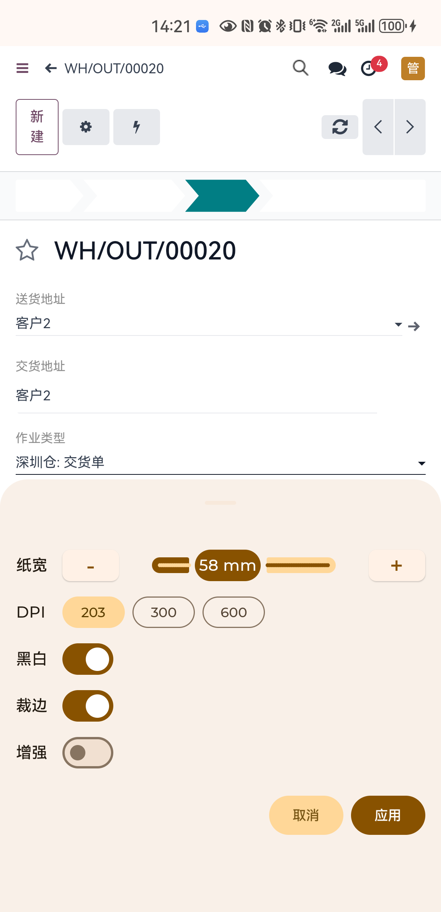
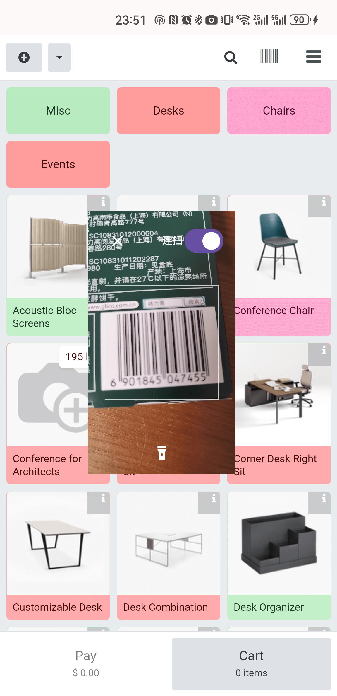
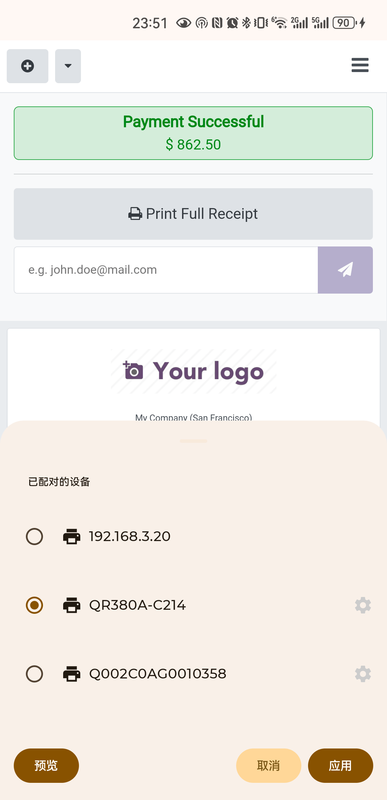
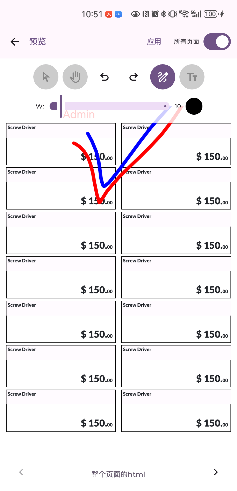
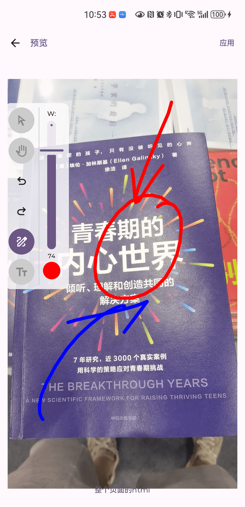
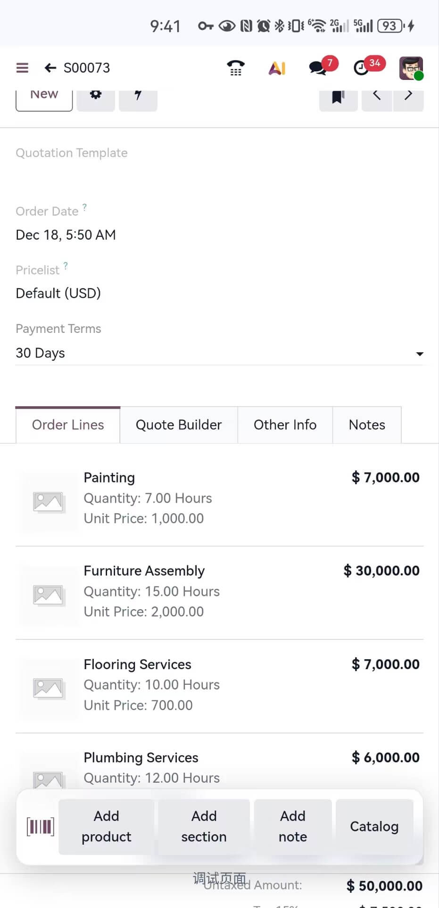
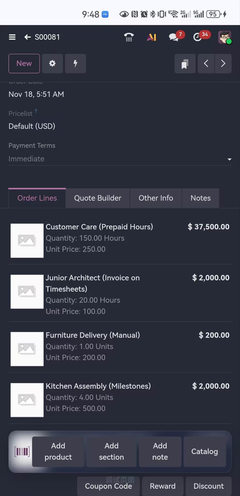

# 🌟[moco-odoo-client](https://odoo.metaerp.ai)
HarmonyOS / Android App for Odoo Enterprise/Community Version
Bluetooth Printer, PDA Scanner, RFID, PDF/Image Annotate supported

# Business Cooperation
1. OEM cooperation supported. Provide your company name, App name, and App icon to get your own installation package.
2. For details, contact: 1069010@qq.com. Please be sure to state your purpose.
3. 1-on-1 consultation fee for non-clients: __1200 RMB/hour__, deductible after a deal is made.
&nbsp;&nbsp;&nbsp;&nbsp;&nbsp;&nbsp;

[中文](./README.md) | [日本語](./README.ja.md)

## Screenshots

| Login | Account Manager |
| :---: | :---: |
|  |  |
| Quick Scan Shortcut | Floating Scanner |
|  |  |
| Push Message | About |
|  |  |
| Sales | AI Support |
|  |  |
| Dark theme | Download / Upload |
|  |  |
| PDF Print | Printer Setting |
|  |  |
| Pos Scanner | Pos Receipt Printing |
|  |  |
| Annotate PDF | Annotate Image |
|  |  |
| Floating x2m buttons(light) | Floating x2m buttons(dark) |
|  |  |

# Note
1. moco-odoo-client_xxx_xx_g(h)ms.apk supports the latest community (codebase after 2024/05/01) and enterprise versions of 16+. This is a long-term support version, supporting both GMS and HMS, the two major Android platforms.
2. Special support for v14 Enterprise Edition.
3. v14e/moco-odoo-client-v1.apk only supports v14 Enterprise Edition and will no longer be supported.
4. For the community version, it is recommended to install a free or paid mobile theme for a better experience.
5. Supports HarmonyOS / Android phones and tablets.
6. Supports continuous scanning, zero installation on the server side! Out of the box!
7. Supports Bluetooth thermal printing / IPP protocol conventional printing, no need to install any modules!
8. Continuously developed and iterated. Any questions or feature suggestions are welcome in the issues.

# TODO
1. Continue to supplement the existing functions of the official App.
2. Integrate AI recognition for paper orders.
~~3. Integrate PDF printing for mainstream thermal printers.~~

# 2026.01.24
1. Support for SUNMI thermal printers, support for high-definition printing of barcodes and QR codes.
2. Support for the latest Odoo version 19.2.
3. Bug fix.

# 2026.01.07
1. Support for SF Express and JD PDA scanning, support for Honeywell barcode scanners.

# 2025.12.24
1. Support for Urovo PDA scanning.

# 2025.12.18
1. Optimized button layout for detail lists, frosted glass effect floating toolbar.

# 2025.10.29
1. Native PDF signature support.
2. Native image editing support.

# 2025.10.20
1. Bug fix.

# 2025.09.27
1. Adapted for Odoo 19.

# 2025.09.04
1. Support for Let's Encrypt certificates on older devices.
2. Bug fixes and performance optimization.

# 2025.06.05
1. Support for iDATA K3Pro handheld PDA scanner.
2. Support for POS scan-to-order.

# 2025.03.15
1. Support for Bluetooth printers to print labels: no extra drivers needed, intelligent label splitting.
2. Support for regular printers: no extra drivers needed, connect via IP for direct printing.

Click to expand/collapse

# 2025.03.04
1. POS bug fix.

# 2025.02.27
1. Bug fix.
2. Allow custom model names for large language models.

# 2025.02.26
1. Bug fix.

# 2025.02.24
1. Bug fix.

# 2025.02.15
1. Quick scan to add product.
2. Bug fix.

# 2025.01.24
1. Barcode scanner bug fix.

# 2025.01.23
1. Support for Odoo v16, adapted and bug fixed for the latest v18 code.

# 2025.01.19
1. Allow downloading Tencent X5 browser kernel on mobile networks to better support ES6 standard JavaScript methods.

# 2024.12.19
1. Bug fix.

# 2024.12.18
1. Bug fix.

# 2024.09.12
1. Bug fix.

# 2024.08.31
1. Integrated PDF printing.
2. Bug fix.

# 2024.06.30
1. Integrated free AI assistant.
2. Bug fix.

# 2024.06.25
1. Login bug fix.
2. Push notification bug fix.

# 2024.06.24
1. Added learning mode, integrated AI, immersive study of every element on the Odoo page.
2. Support for Odoo v14 Enterprise Edition (camera scanning).

# 2024.06.12
1. HMS push notification platform deployed, contact me for the push interface address.

# 2024.06.10
1. Support for Google GMS platform (not fully tested).
2. Bug fix.

# 2024.05.28
1. Storage permission request bug fix.

# 2024.05.22
1. Optimized scanning logic for the community version, only product fields are associated with the scanning function.
2. Enterprise edition supports using the camera for product scanning during warehouse operations (a feature not yet supported by Odoo official).
3. Numerous bug fixes.

# 2024.05.18
1. Integrated HMS Push Kit, supports native Android push notifications.
* Requires installing 1 module on the server side, which is open source.

# 2024.05.07
1. Refactored for Odoo V17, supports community and enterprise editions.

# 2022.07.26
1. Fixed a bug where there was no response in PDF presentation mode.

# 2022.07.04
1. Upgraded some dependency library versions.
2. Scanning SDK upgraded, performance optimized.
3. Integrated Huawei Analytics.

# 2022.07.03
1. Fixed a bug where clicking to switch accounts would open the system browser.

# 2022.01.17
1. Handle phone links on the page, automatically jump to the dialer interface.
2. Handle email links on the page, automatically open the email client.

# 2022.01.10
1. When login fails on the account management interface, automatically carry the username and server address to the login interface.

# 2021.10.29
1. Refactored the login process.
2. Support for dark theme.

# 2021.10.20
1. Modified the scanning logic to be consistent with the official App's behavior by default: click scan -> open camera -> parse successfully -> return.
2. Continuous scanning requires minor code adaptation on the Odoo server side.

# 2021.10.20
1. Alpha version released.

# Odoo Development, Apk Download, Usage Issues Discussion Group
