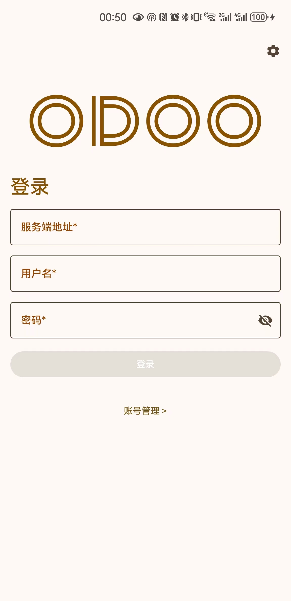
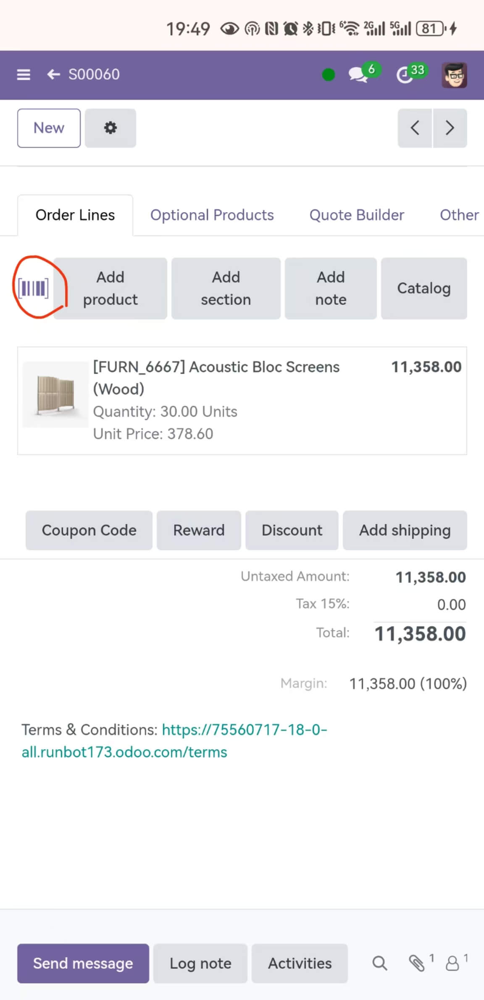
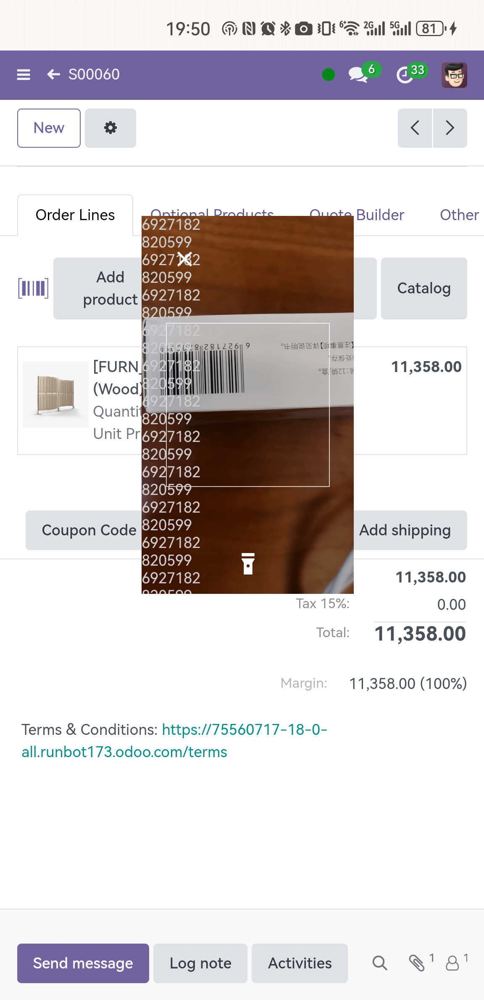
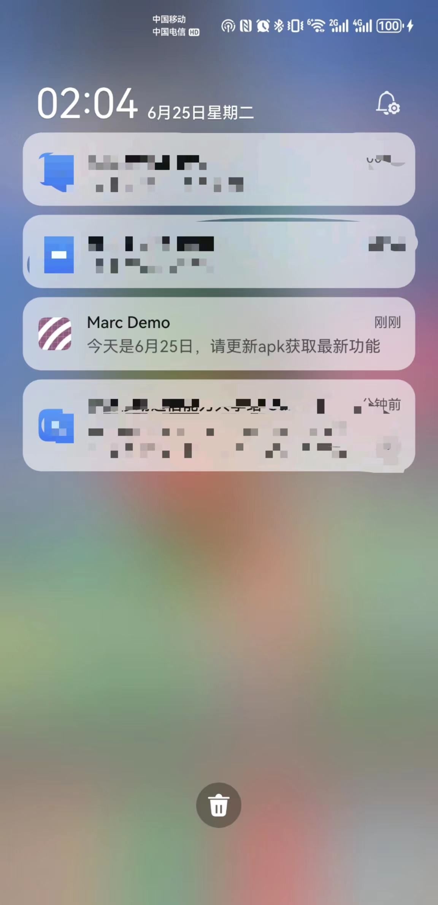
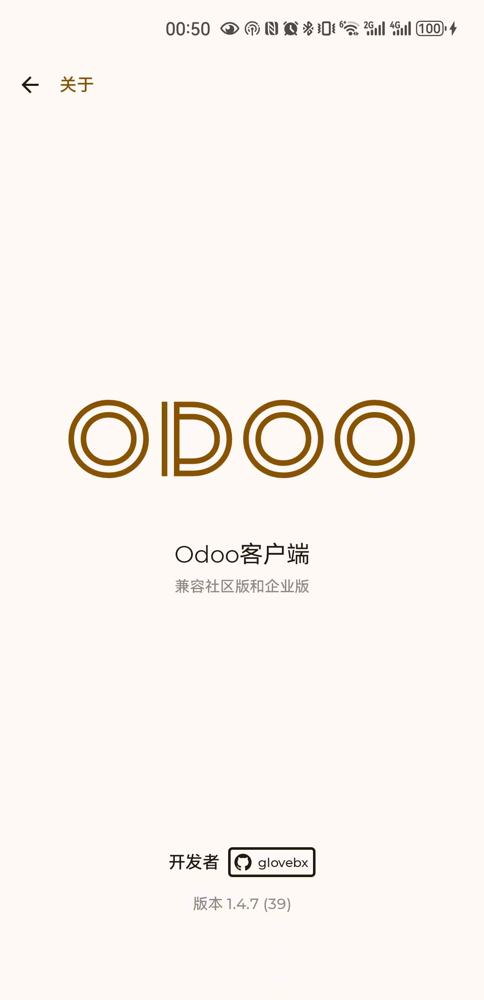
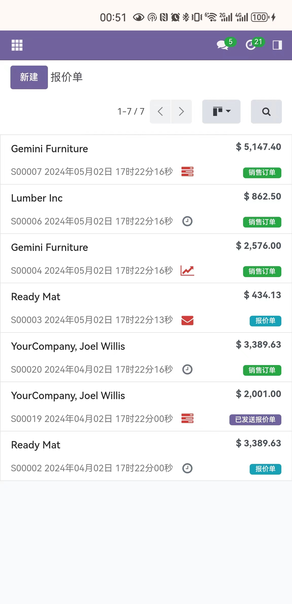
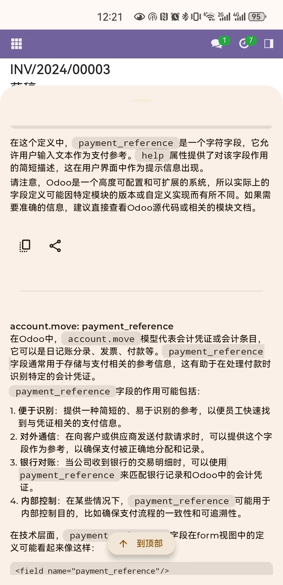
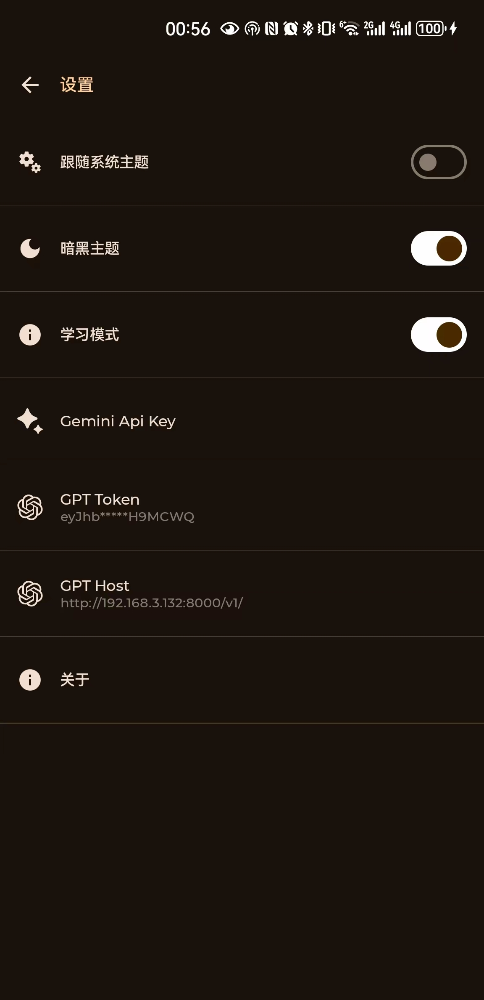
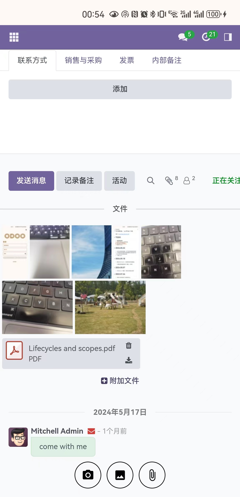
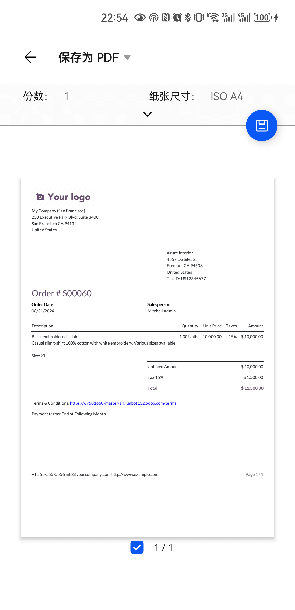

# 🌟[moco-odoo-client](https://odoo.metaerp.ai)
Mobile App for Odoo Enterprise/Community Version

# 商业合作
1、支持OEM合作，提供公司名、App名、App图标，即可提供属于你的安装包  
2、细节咨询➕Q：1069010，请注明来意  
3、你也可以给我买杯咖啡表示支持  
&nbsp;&nbsp;&nbsp;&nbsp;&nbsp;&nbsp;

## 截屏

| Login     | Account Manager     | 
| :-------------: | :-------------: | 
|  |  | 
| Quick Scan Shortcut     | Floating Scanner     | 
|  |  | 
| Push Message     | About     | 
|  |  | 
| Sales     | AI Support     | 
|  |  | 
| Dark theme     | Download / Upload  | 
|  |  | 
| PDF Print     | 
|  |  

# 注意
1、moco-odoo-client_xxx_xx_g(h)ms.apk支持16+最新的社区版（2024/05/01之后的代码基）和企业版，此为长期支持版本，支持GMS、HMS两个安卓主流平台  
2、特别支持v14企业版  
3、v14e/moco-odoo-client-v1.apk仅支持14企业版，后续不再支持  
4、社区版本，建议安装免费或收费的手机主题获得更好的体验  
5、当前仅支持Android手机和平板，Mac及Windows尚未正式适配   
6、支持连续扫码功能，服务器端零安装！开箱即用！   
7、开发中，有建议欢迎提issue  
8、目前有部分非华为手机登录时可能报错，请提issue

~~# 安卓设备相关报错解决~~
~~部分旧的Android设备，运行时会报告有关 Object.hasOwn 的错误，需在 /odoo/addons/web/`__manifest__`.py 文件~~  
~~的 'web.assets_backend'中加入以下两个补丁文件：~~  
~~'web/static/src/polyfills/object.js',~~  
~~'web/static/src/polyfills/array.js',~~  
~~参考PR：https://github.com/odoo/odoo/pull/160758~~  

# iOS原型，已停止开发
查看 🌟[Odoo Shop Client for iOS](https://github.com/glovebx/odoo-shop-iOS)

# TODO
1、~~重构登录流程~~  
2、继续补足官方App现有功能   
3、整合纸质订单AI识别   
~~4、整合PDF打印~~   

# 2025.02.27  
1、bug fix  
2、允许自定义大模型的model名  

# 2025.02.26  
1、bug fix  

# 2025.02.24  
1、bug fix  

# 2025.02.15  
1、quick scan to add product  
2、bug fix  

# 2025.01.24  
1、barcode scanner bug fix  

# 2025.01.23  
1、支持Odoo v16，针对最新v18的代码进行了适配和bug fix  

# 2025.01.19  
1、允许手机网络下下载腾讯X5浏览器内核，以便更好的支持ES6标准的javascript方法  

# 2024.12.19  
1、bug fix  

# 2024.12.18  
1、bug fix  

# 2024.09.12  
1、bug fix  

# 2024.08.31  
1、整合PDF打印  
2、bug fix  

# 2024.06.30  
1、整合免费的AI回答助手  
2、bug fix  

# 2024.06.25  
1、登录 bug fix  
2、消息推送 bug fix  

# 2024.06.24  
1、新增学习模式，整合AI，沉浸式研究Odoo页面上的每一个元素  
2、支持 Odoo v14 企业版（摄像头扫码）  

# 2024.06.12  
1、HMS 消息推送平台已部署，联系我获取推送接口地址  

# 2024.06.10  
1、支持Google GMS平台（未全面测试）  
2、bug fix  

# 2024.05.28  
1、存储权限申请 bug fix  

# 2024.05.22  
1、优化社区版扫码逻辑，仅产品字段关联扫码功能  
2、企业版支持仓库操作时使用摄像头扫码处理产品（Odoo官方尚未支持的功能）  
3、大量 bug fix  

# 2024.05.18  
1、整合HMS Push Kit，支持原生安卓消息推送
* 需要在服务器端安装1个模块，已开源  

# 2024.05.07  
1、针对Odoo V17重构，支持社区版和企业版  

# 2022.07.26  
1、修改PDF演示模式下无响应的bug  

# 2022.07.04  
1、升级部分依赖库版本  
2、扫码SDK升级，性能优化  
3、整合华为分析  

# 2022.07.03  
1、修改点击切换账号时会打开系统浏览器的bug  

# 2022.01.17  
1、处理页面中的电话链接，自动跳转到拨打电话界面  
2、处理页面中的邮件链接，自动打开邮件客户端  

# 2022.01.10
1、账号管理界面登录失败时，自动携带用户名和服务器地址跳转到登录界面  

# 2021.10.29
1、重构了登录流程   
2、支持暗黑主题   

# 2021.10.20
1、修改扫码逻辑，默认跟官方App行为一致:点击扫码->打开摄像头->解析成功->返回  
2、连续扫码需要Odoo服务端做少量代码适配

# 2021.10.20
1、发布alpha版

# Odoo开发、Apk下载、使用问题交流群

